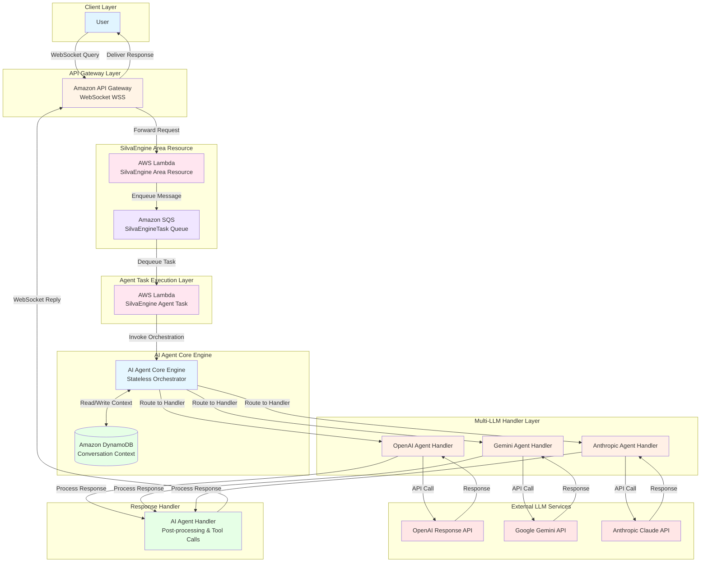
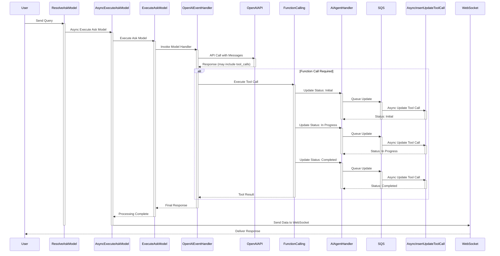
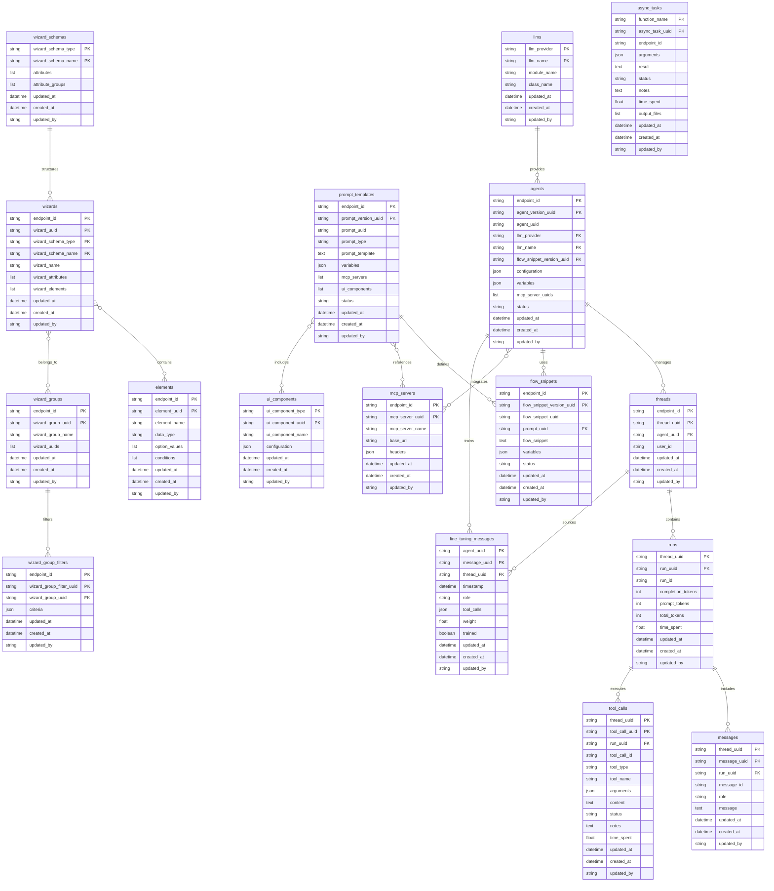

### 🌍 Stateless. Scalable. Multi-LLM.

# **The Next Evolution in AI Agent Orchestration (AI Agent Core Engine)**

Run and scale intelligent agents across **multiple LLMs** — without managing state or sessions.
Built on the **SilvaEngine serverless framework**, our platform delivers **rolling context memory**, modular **function calling**, and real-time **conversation monitoring** — all in one unified, AI-native control plane.

**⚡ Stateless by design** – infinite scale, instant recovery

**🧠 Model-agnostic** – OpenAI, Anthropic, Gemini, and more

**🔌 Modular architecture** – plug-and-play function routing

**📈 Fully observable** – every conversation, recorded and traceable

## **Introduction**

🌐 **The World’s First Stateless Multi-LLM Agent Orchestration Platform**

Welcome to the future of AI agent infrastructure — a revolutionary platform that redefines how intelligent agents are deployed, scaled, and orchestrated across diverse LLM ecosystems. Powered by the **SilvaEngine serverless framework**, this stateless platform offers unmatched agility, reliability, and speed in handling AI-driven conversations at scale.

🔁 **Stateless by Design. Context-Rich by Architecture.**
Say goodbye to complex session management. Our platform enables **rolling context memory**, ensuring every conversation retains critical relevance — without the weight of persistent storage. This lets you scale infinitely, recover instantly, and run lightweight AI agents that remain deeply aware and responsive.

🧠 **Multi-Model Intelligence. Modular Functionality.**
Orchestrate and switch between top-tier LLMs — OpenAI, Anthropic, Gemini, and more — in real time. Our modular function-calling engine enables **plug-and-play capabilities**, allowing agents to invoke domain-specific tools and workflows, no matter which model powers the response.

🔍 **Thread-Aware Monitoring & Observability**
Every conversation is **recorded, versioned, and monitored**, giving your teams full visibility into interaction history, decision logic, and user intent. Gain insights, audit compliance, and optimize performance with intelligent observability built into the core.

🧩 **Built for Builders. Trusted by Enterprises.**
Whether you're launching autonomous agents, enhancing customer service, or powering next-gen copilots, this platform equips you with the **flexibility of serverless**, the **power of orchestration**, and the **precision of stateless memory** — all in one unified, AI-native control plane.

🔐 **Secure. Scalable. Future-Proof.**
Designed to meet the needs of mission-critical applications, our platform embraces security-first principles, auto-scaling infrastructure, and modular integration to support evolving enterprise demands in AI deployment.

### Key Features

#### 🔧 **Core Features**

| **Feature**                            | **Description**                                                              |
| -------------------------------------- | ---------------------------------------------------------------------------- |
| **Stateless Architecture**             | Eliminates session handling for infinite scalability and instant recovery.   |
| **Rolling Context Memory**             | Maintains conversational context without persisting full session state.      |
| **Multi-LLM Orchestration**            | Real-time switching and integration across OpenAI, Anthropic, Gemini, etc.   |
| **Modular Function Calling**           | Plug-and-play routing of tool/function calls across different models.        |
| **Serverless Framework (SilvaEngine)** | Built on a scalable, lightweight, cloud-native infrastructure.               |
| **Model-Agnostic Compatibility**       | Supports diverse LLM providers with seamless fallback or parallel execution. |

---

#### 🧠 **Intelligence & Functionality**

| **Feature**                              | **Description**                                                                |
| ---------------------------------------- | ------------------------------------------------------------------------------ |
| **Thread-Aware Conversation Monitoring** | Tracks and logs conversations with full visibility and lineage.                |
| **Real-Time Decision Traceability**      | Each agent interaction is versioned and auditable for debugging or compliance. |
| **Autonomous Agent Enablement**          | Designed to support agent autonomy with dynamic decision-making.               |
| **Domain-Specific Tool Invocation**      | Agents can call tools dynamically based on domain and user context.            |

---

#### 📊 **Observability & Control**

| **Feature**                      | **Description**                                                     |
| -------------------------------- | ------------------------------------------------------------------- |
| **Full Interaction Logging**     | Stores every user-agent exchange for analytics and optimization.    |
| **Versioned Execution Contexts** | Enables replay and regression testing of agent decisions.           |
| **Live Conversation Monitoring** | Allows real-time viewing and intervention of ongoing agent threads. |

---

#### 🔐 **Enterprise-Grade Infrastructure**

| **Feature**                    | **Description**                                                            |
| ------------------------------ | -------------------------------------------------------------------------- |
| **Security-First Design**      | Includes audit trails, identity boundaries, and secure execution policies. |
| **Auto-Scaling**               | Grows with usage demand without manual provisioning.                       |
| **Modular Integration Layer**  | Easily connects to internal tools, APIs, or databases.                     |
| **Future-Proof Compatibility** | Adapts to evolving AI models and enterprise infrastructure needs.          |


### 🧠 **Stateless Multi-LLM AI Agent Core Engine — Architecture Overview**

This diagram showcases a **serverless, multi-LLM AI agent orchestration system** powered by **SilvaEngine**. It supports **real-time interactions over WebSocket**, integrates **multiple LLMs (OpenAI, Gemini, Claude)**, and executes tasks using **asynchronous Lambda functions and modular handlers**.



---

#### 🔄 **End-to-End Flow Description (Updated)**

##### 1. **User Interaction (WebSocket Query)**

* The **User** initiates a query via **WebSocket (WSS)**.
* The query is routed through **Amazon API Gateway**, acting as a real-time interface for bidirectional communication.

##### 2. **Initial Message Routing**

* API Gateway forwards the request to an **AWS Lambda** (`SilvaEngine Area Resource`) for validation, routing logic, and enqueueing.
* The message is pushed to **Amazon SQS** (`SilvaEngineTask Queue`) for asynchronous, decoupled task execution.

##### 3. **Agent Task Execution (Async)**

* **SilvaEngine Agent Task**, another Lambda function, dequeues the message and invokes:

  * Tool calling logic.
  * AI agent orchestration.
  * External function integrations.

##### 4. **AI Agent Core Orchestration**

* The **AI Agent Core Engine** acts as the **stateless orchestrator**. Responsibilities include:

  * Managing **conversation context** using **Amazon DynamoDB**.
  * Delegating the query to the appropriate **LLM Agent Handler** based on routing rules or model availability.

##### 5. **Multi-LLM Routing via Agent Handlers**

* The platform supports multiple language models via **dedicated handlers**:

  * **OpenAI Agent Handler** → routes to **OpenAI Response API**
  * **Gemini Agent Handler** → routes to **Google Gemini API**
  * **Anthropic Agent Handler** → routes to **Anthropic Claude API**

Each handler formats, sends, and processes responses independently, enabling **model-agnostic orchestration**.

##### 6. **Final AI Response Handling**

* The **AI Agent Handler** (green box) handles:

  * Response post-processing.
  * Tool call updates.
  * State updates and results formatting.
  * Sends **WebSocket replies** to the user via the original API Gateway connection.

---

#### 🌐 **New Capabilities Highlighted**

| Feature                    | Description                                                                         |
| -------------------------- | ----------------------------------------------------------------------------------- |
| **True Multi-LLM Support** | Unified engine dynamically selects and communicates with OpenAI, Gemini, or Claude. |
| **Modular Handler Layer**  | Handlers for each model can be independently managed, scaled, or extended.          |
| **Extensible Backend**     | Easily add future models or vendors by plugging in new handler modules.             |

---

### 🔄 **AI Agent Orchestration: Sequence Flow Description**



#### 🧍‍♂️ **1. User Initiates Query**

* The **user** sends a query via WebSocket.
* The message is received by the system and triggers the **Resolve Ask Model** step.

---

#### 🔁 **2. Model Resolution & Execution Initiation**

| Step | Component                   | Description                                                                     |
| ---- | --------------------------- | ------------------------------------------------------------------------------- |
| ✅    | **Resolve Ask Model**       | Identifies which AI model (e.g., OpenAI, Gemini, Claude) to use.                |
| 🔄   | **Async Execute Ask Model** | Asynchronously invokes execution logic.                                         |
| 🚀   | **Execute Ask Model**       | Begins actual agent processing and prepares the message for the selected model. |

---

#### 🧠 **3. Language Model Interaction**

| Step | Component               | Description                                                                                         |
| ---- | ----------------------- | --------------------------------------------------------------------------------------------------- |
| 📩   | **OpenAIEventHandler**  | Handles communication with the OpenAI API.                                                          |
| 🤖   | **OpenAI Response API** | Processes the query and returns a structured response, potentially with function call instructions. |

---

#### 🔧 **4. Function Calling Workflow (if applicable)**

* If the response includes a **tool/function call**, it’s passed to the **Function Calling Module**.
* This module:

  * Executes the requested tool/module logic.
  * Triggers **multiple async updates** to the system about the tool's status:

    * 🔸 *Initial*
    * 🔸 *In Progress*
    * 🔸 *Completed*

---

#### 🔄 **5. Tool Call Handling and Agent Coordination**

| Component                         | Description                                                                                        |
| --------------------------------- | -------------------------------------------------------------------------------------------------- |
| **AI Agent Handler**              | Orchestrates the tool call update flow and prepares the final response.                            |
| **AWS SQS**                       | Used for decoupled communication and state update queuing.                                         |
| **Async Insert Update Tool Call** | Lambda functions or microservices that handle stepwise updates (initial → in progress → complete). |

---

#### 📤 **6. Final Delivery via WebSocket**

* Once the task is completed and results are ready:

  * The system asynchronously triggers **Send Data to WebSocket**.
  * The **user receives the final response** through the established WSS connection.

---

### 🧩 **Key Flow Highlights**

| Area                        | Purpose                                                                        |
| --------------------------- | ------------------------------------------------------------------------------ |
| ✅ Model Decoupling          | The LLM model execution is abstracted away from the user-facing logic.         |
| 🔄 Asynchronous Operations  | All tool updates and executions are handled via async invokes for scalability. |
| 🔌 Modular Function Calling | Allows LLM responses to dynamically trigger domain-specific operations.        |
| 📡 Real-time Delivery       | Results are delivered back to the user over the original WebSocket channel.    |

---

### 🧩 **ER Diagram Overview: Modular AI Agent Orchestration System**

This ER diagram structures the system into the following core **logical domains**:



---

#### 🔵 **1. Language Models & Agent Definitions**

##### **`llms`**

* Stores metadata about each supported language model (OpenAI, Anthropic, Gemini, etc.).
* Keys: `llm_provider`, `llm_name`
* Includes: `module_name`, `class_name`, `updated_by`, `created_at`

##### **`agents`**

* Defines each AI agent version and its configuration.
* Keys: `endpoint_id`, `agent_version_uuid`, `agent_uuid`
* Maps to: `llm_provider`, `llm_name`
* Includes function mappings, tool call behavior, and message limits.

---

#### 🧠 **2. Thread & Message Management**

##### **`threads`**

* Represents a full conversation session (thread) for a user-agent pair.
* Keys: `endpoint_id`, `thread_uuid`
* Associates with: `agent_uuid`, `user_id`

##### **`messages`**

* Stores each individual message in a thread.
* Keys: `thread_uuid`, `message_uuid`, `run_uuid`
* Includes: `role`, `message`, `created_at`, etc.

##### **`runs`**

* Represents a single inference call in a conversation (mapped to a model request).
* Keys: `thread_uuid`, `run_uuid`
* Tracks: token usage, duration, endpoint\_id, etc.

---

#### ⚙️ **3. Tool Calling & Async Execution**

##### **`tool_calls`**

* Tracks all function/tool calls invoked by the agent within a thread and run.
* Keys: `thread_uuid`, `tool_call_uuid`, `run_uuid`
* Attributes: `tool_type`, `arguments`, `content`, `status`, `notes`, `time_spent`

##### **`async_tasks`**

* Logs background async operations such as tool executions or external API calls.
* Keys: `function_name`, `async_task_uuid`
* Includes: `endpoint_id`, `arguments`, `result`, `status`, `notes`, `time_spent`

---

#### 🧪 **4. Fine-Tuning Data Management**

##### **`fine_tuning_messages`**

* Stores structured messages and tool calls for supervised fine-tuning.
* Keys: `agent_uuid`, `message_uuid`, `thread_uuid`, `timestamp`
* Attributes: `role`, `tool_calls`, `weight`, `trained`

---

#### 🔄 **5. Modular Function Configuration**

##### **`functions`**

* Registry of callable functions used in tool calling.
* Key: `function_name`
* Includes: `function` object with `module_name`, `class_name`, and `configuration`.

##### **`configuration (OpenAI) as an example`**

* A nested structure defining configuration options specific to OpenAI integration as an example.
* Includes: `openai_api_key`, `tools`, `max_output_tokens`, `temperature`, etc.

---

### 🔗 **Entity Relationships Summary**

| Relationship                                | Description                                                   |
| ------------------------------------------- | ------------------------------------------------------------- |
| `agents ↔ llms`                             | Each agent maps to a specific LLM definition.                 |
| `threads ↔ agents`                          | A thread is linked to the agent version and endpoint.         |
| `messages ↔ threads`                        | Messages are grouped by thread and run.                       |
| `runs ↔ threads`                            | Each model inference (run) occurs in a thread context.        |
| `tool_calls ↔ runs/messages`                | Tool calls are tied to a specific run and message.            |
| `async_tasks ↔ tool_calls`                  | Background tasks are logged independently and asynchronously. |
| `fine_tuning_messages ↔ threads/tool_calls` | Enables training data extraction per thread.                  |

---

## 📊 **Models Relationship & Architecture**

This section provides a comprehensive overview of the domain models, their relationships, and architectural patterns used throughout the AI Agent Core Engine.

---

### 🗂️ **Model Inventory**

The platform consists of **17 core models** organized into logical domains:

#### **1. Core Conversation Flow Models**

| Model | Table | Purpose | Key Relationships |
|-------|-------|---------|-------------------|
| **Agent** | `aace-agents` | Defines AI agent versions and configurations | → LLM, FlowSnippet, MCPServer |
| **Thread** | `aace-threads` | Represents a conversation session | ← Agent, → Runs |
| **Run** | `aace-runs` | Single execution/inference within a thread | ← Thread, → Messages, ToolCalls |
| **Message** | `aace-messages` | Individual messages in a conversation | ← Thread, Run |
| **ToolCall** | `aace-tool_calls` | Function/tool invocations by agents | ← Thread, Run |

#### **2. Configuration & Template Models**

| Model | Table | Purpose | Key Relationships |
|-------|-------|---------|-------------------|
| **LLM** | `aace-llms` | Language model provider definitions | ← Agents |
| **PromptTemplate** | `aace-prompt_templates` | Versioned prompt templates | → FlowSnippets, MCPServers, UIComponents |
| **FlowSnippet** | `aace-flow_snippets` | Versioned flow context snippets | ← PromptTemplate, ← Agents |
| **MCPServer** | `aace-mcp_servers` | External MCP server configurations | ← Agents, PromptTemplates |
| **UIComponent** | `aace-ui_components` | UI element definitions | ← PromptTemplates |

#### **3. Wizard & Configuration Models**

| Model | Table | Purpose | Key Relationships |
|-------|-------|---------|-------------------|
| **Wizard** | `aace-wizards` | Configuration wizards | → WizardSchema, Elements, WizardGroups |
| **WizardSchema** | `aace-wizard_schemas` | Schema templates for wizards | ← Wizards |
| **WizardGroup** | `aace-wizard_groups` | Groups of related wizards | → Wizards, ← WizardGroupFilters |
| **WizardGroupFilter** | `aace-wizard_group_filters` | Filter logic for wizard groups | → WizardGroups |
| **Element** | `aace-elements` | Configurable UI/form elements | ← Wizards |

#### **4. Training & Async Models**

| Model | Table | Purpose | Key Relationships |
|-------|-------|---------|-------------------|
| **FineTuningMessage** | `aace-fine_tuning_messages` | Messages for model fine-tuning | ← Agent, Thread |
| **AsyncTask** | `aace-async_tasks` | Background task tracking | Independent |

---

### 🔗 **Relationship Patterns**

#### **1. Hierarchical Conversation Flow** (Primary Workflow)

```
┌─────────────────────────────────────────────────────────────┐
│                   CONVERSATION HIERARCHY                     │
└─────────────────────────────────────────────────────────────┘

LLM (OpenAI/Gemini/Anthropic/Ollama)
  │
  └──> Agent (1:N) ──┐
          │          │
          │          └──> FlowSnippet (1:1) ──> PromptTemplate (1:1)
          │
          └──> Thread (1:N) ──> Run (1:N) ──┬──> Message (1:N)
                                             └──> ToolCall (1:N)
```

**Cascade Delete Protection:**
- Cannot delete Agent if Threads exist
- Cannot delete Thread if Runs exist
- Cannot delete Run if Messages or ToolCalls exist
- Cannot delete LLM if Agents reference it

**Key Fields:**
- Agent references LLM via: `llm_provider` + `llm_name`
- Thread references Agent via: `agent_uuid`
- Run belongs to: `thread_uuid`
- Message/ToolCall belong to: `thread_uuid` + `run_uuid`

---

#### **2. Configuration & Template System**

```
┌─────────────────────────────────────────────────────────────┐
│                  CONFIGURATION HIERARCHY                     │
└─────────────────────────────────────────────────────────────┘

PromptTemplate (versioned)
  │
  ├──> FlowSnippet (1:N, versioned)
  │       └──> Agent (1:N, references via flow_snippet_version_uuid)
  │
  ├──> MCPServer (N:N, via mcp_servers list)
  │       └──> Agent (N:N, via mcp_server_uuids list)
  │
  └──> UIComponent (N:N, via ui_components list)
```

**Reference Patterns:**
- PromptTemplate stores: `mcp_servers[]`, `ui_components[]` as lists
- FlowSnippet references: `prompt_uuid` (logical ID, not version)
- Agent references: `flow_snippet_version_uuid` (specific version)
- Agent stores: `mcp_server_uuids[]` for direct MCP access

---

#### **3. Wizard Configuration System**

```
┌─────────────────────────────────────────────────────────────┐
│                      WIZARD SYSTEM                           │
└─────────────────────────────────────────────────────────────┘

WizardSchema (defines structure)
  │
  └──> Wizard (1:N) ──┬──> Element (N:N, via wizard_elements[])
                      │
                      └──> WizardGroup (N:N, via wizard_uuids[])
                              │
                              └──> WizardGroupFilter (1:N)
```

**Reference Fields:**
- Wizard → WizardSchema: `wizard_schema_type` + `wizard_schema_name`
- Wizard → Elements: `wizard_elements[{element_uuid, ...}]`
- WizardGroup → Wizards: `wizard_uuids[]`
- WizardGroupFilter → WizardGroup: `wizard_group_uuid`

---

### 🔄 **Versioning Pattern**

Three models support **multi-version architecture**:

| Model | Logical ID | Version ID | Status Field |
|-------|------------|------------|--------------|
| **Agent** | `agent_uuid` | `agent_version_uuid` | `status` |
| **PromptTemplate** | `prompt_uuid` | `prompt_version_uuid` | `status` |
| **FlowSnippet** | `flow_snippet_uuid` | `flow_snippet_version_uuid` | `status` |

**Versioning Rules:**
1. Multiple versions share the same logical ID
2. Only ONE version can have `status="active"` at a time
3. Creating a new version auto-inactivates the previous active version
4. Deleting an active version promotes the most recent inactive version
5. Agents automatically update when FlowSnippets are versioned

**Example:**
```
agent_uuid: "abc-123"
├─ agent_version_uuid: "v1-uuid" (status: "inactive")
├─ agent_version_uuid: "v2-uuid" (status: "inactive")
└─ agent_version_uuid: "v3-uuid" (status: "active")  ← Current version
```

---

### 🗝️ **Primary Key Patterns**

#### **Multi-Tenant Pattern** (Most Models)
```
Hash Key: endpoint_id (tenant isolation)
Range Key: {entity}_uuid
```
**Models:** Agent, Thread, PromptTemplate, FlowSnippet, Wizard, WizardGroup, WizardGroupFilter, Element

#### **Shared Resource Pattern**
```
Hash Key: {type}_field
Range Key: {name}_field
```
**Models:**
- LLM: `llm_provider` + `llm_name`
- WizardSchema: `wizard_schema_type` + `wizard_schema_name`
- UIComponent: `ui_component_type` + `ui_component_uuid`

#### **Conversation Context Pattern**
```
Hash Key: thread_uuid (conversation scope)
Range Key: {entity}_uuid
```
**Models:** Run, Message, ToolCall, FineTuningMessage

#### **Function-Based Pattern**
```
Hash Key: function_name
Range Key: async_task_uuid
```
**Models:** AsyncTask

---

### 📑 **Index Strategies**

#### **Local Secondary Indexes (LSI)** - Query within partition

| Model | Index Name | Purpose |
|-------|------------|---------|
| Agent | `agent_uuid-index` | Query all versions of an agent |
| Thread | `agent_uuid-index` | Find all threads for an agent |
| Thread | `updated_at-index` | Query threads by time |
| Run | `updated_at-index` | Query runs by time |
| Message | `run_uuid-index` | Find all messages in a run |
| Message | `updated_at-index` | Query messages by time |
| ToolCall | `run_uuid-index` | Find all tool calls in a run |
| ToolCall | `updated_at-index` | Query tool calls by time |
| PromptTemplate | `prompt_uuid-index` | Query all versions of a prompt |
| PromptTemplate | `prompt_type-index` | Find prompts by type |
| FlowSnippet | `flow_snippet_uuid-index` | Query all versions |
| FlowSnippet | `prompt_uuid-index` | Find flows by prompt template |
| Element | `data_type-index` | Find elements by type |
| FineTuningMessage | `thread_uuid-index` | Find training messages by thread |
| FineTuningMessage | `timestamp-index` | Query by time |

#### **Global Secondary Index (GSI)** - Query across partitions

| Model | Index Name | Purpose |
|-------|------------|---------|
| AsyncTask | `endpoint_id-updated_at-index` | Query tasks by tenant + time |

---

### 🧩 **Composite Attributes (Nested Structures)**

Many models use **MapAttribute** and **ListAttribute** for flexible schemas:

#### **Agent**
```python
configuration: MapAttribute  # LLM-specific settings
variables: List[MapAttribute]  # [{name, value}, ...]
```

#### **PromptTemplate**
```python
variables: List[MapAttribute]  # Template variables
mcp_servers: List[MapAttribute]  # Server references
ui_components: List[MapAttribute]  # Component references
```

#### **Wizard**
```python
wizard_attributes: List[MapAttribute]  # [{name, value}, ...]
wizard_elements: List[MapAttribute]  # [{element_uuid, required, ...}, ...]
```

#### **WizardSchema**
```python
attributes: List[MapAttribute]  # Full attribute definitions
attribute_groups: List[MapAttribute]  # Grouping metadata
```

#### **Element**
```python
option_values: List[MapAttribute]  # Selectable options
conditions: List[MapAttribute]  # Conditional rules
```

#### **AsyncTask**
```python
arguments: MapAttribute  # Function arguments
output_files: List[MapAttribute]  # File metadata
```

---

### 🎯 **Key Architectural Decisions**

#### **1. Multi-Tenancy via `endpoint_id`**
- Isolates data by tenant at the partition level
- Ensures data security and access control
- Exceptions: LLM, WizardSchema, UIComponent (shared resources)

#### **2. Stateless with Context Persistence**
- Conversation state stored in DynamoDB
- Agents are stateless compute units
- Context reconstructed from Thread → Run → Message/ToolCall chain

#### **3. Denormalization for Performance**
- Agent stores direct LLM references (`llm_provider`, `llm_name`)
- Avoids joins; resolves at query time
- Trade-off: Data duplication vs. read performance

#### **4. Flexible Schemas with MapAttribute**
- Configuration stored as JSON-like structures
- Enables schema evolution without migrations
- Used for: `configuration`, `variables`, `criteria`, `headers`, etc.

#### **5. Cascading Cache Invalidation**
- All models implement intelligent caching
- Cache purge cascades through relationships (depth=3)
- Example: Agent update → Thread cache → Run cache → Message cache

#### **6. Soft Deletes via Status**
- Versioned entities use `status="active"/"inactive"`
- Preserves history and audit trail
- Enables rollback capabilities

#### **7. Dynamic Tool Resolution**
- MCPServer doesn't store tools in DB
- Tools fetched dynamically via HTTP at runtime
- Ensures tools are always current

---

### 📈 **Data Flow Example**

```
User Query
   │
   ├──> 1. Lookup Agent (by agent_uuid)
   │      ├──> Resolve LLM (via llm_provider + llm_name)
   │      ├──> Resolve FlowSnippet (via flow_snippet_version_uuid)
   │      │      └──> Resolve PromptTemplate (via prompt_uuid)
   │      └──> Resolve MCPServers (via mcp_server_uuids[])
   │
   ├──> 2. Find/Create Thread (by endpoint_id + agent_uuid)
   │
   ├──> 3. Create Run (in thread_uuid)
   │
   ├──> 4. Store Messages (in thread_uuid + run_uuid)
   │      └──> role: "user" | "assistant" | "system" | "tool"
   │
   ├──> 5. Execute ToolCalls (if LLM requests function calls)
   │      └──> Store in thread_uuid + run_uuid
   │      └──> Update status: "initial" → "completed"
   │
   └──> 6. Track Tokens & Time (in Run model)
          └──> completion_tokens, prompt_tokens, time_spent
```

---

### 🔍 **Query Patterns**

#### **Get Active Agent Version**
```python
# Using agent_uuid-index LSI
Agent.query(
    endpoint_id,
    Agent.agent_uuid == "abc-123",
    Agent.status == "active"
)
```

#### **Get All Threads for Agent**
```python
# Using agent_uuid-index LSI
Thread.query(
    endpoint_id,
    Thread.agent_uuid == "abc-123"
)
```

#### **Get All Messages in a Run**
```python
# Using run_uuid-index LSI
Message.query(
    thread_uuid,
    Message.run_uuid == "run-456"
)
```

#### **Get Recent Tool Calls**
```python
# Using updated_at-index LSI
ToolCall.query(
    thread_uuid,
    scan_index_forward=False,  # Descending order
    limit=10
)
```

#### **Find Async Tasks by Tenant**
```python
# Using endpoint_id-updated_at-index GSI
AsyncTask.endpoint_id_updated_at_index.query(
    endpoint_id,
    scan_index_forward=False
)
```

---

### 📚 **Audit & Compliance**

All models include standard audit fields:

```python
updated_by: str  # User/system identifier
created_at: datetime  # Creation timestamp (UTC)
updated_at: datetime  # Last modification timestamp (UTC)
```

These enable:
- Complete audit trails
- Compliance reporting
- Debugging and troubleshooting
- Data lineage tracking

---

Certainly! Here's a rephrased and enhanced version:

---

## ⚙️**Deployment and Setup**

To successfully deploy and configure the AI Agent, please follow the detailed instructions provided in the [AI Agent Deployment Guide](https://github.com/ideabosque/ai_agent_deployment). This resource includes step-by-step guidance to ensure a smooth and efficient setup process.

## 🤖 **Agent Definition & Configuration (Event Handler Layer)**

This section defines the architecture for how agents are implemented, extended, and executed using a modular, class-based event handling system. It enables **runtime polymorphism** across different language model providers such as OpenAI, Gemini, Anthropic, and Ollama.

```mermaid
classDiagram
    class AIAgentEventHandler {
        <<abstract>>
        +str endpoint_id
        +str agent_name
        +str agent_description
        +dict short_term_memory
        +dict settings_dict
        +dict accumulated_json
        +invoke_async_func(function_name, arguments)
        +send_data_to_stream(data, connection_id)
        +get_function(function_name)
        +accumulate_partial_json(chunk)
        +invoke_model()* abstract
    }

    class OpenAIEventHandler {
        +OpenAI client
        +dict model_settings
        +invoke_model(messages, tools, stream)
        -handle_streaming()
        -parse_tool_calls()
        -track_tokens()
    }

    class GeminiEventHandler {
        +genai.Client client
        +dict model_settings
        +list assistant_messages
        +invoke_model(prompt, tools, stream)
        -handle_gemini_events()
        -format_response()
    }

    class AnthropicEventHandler {
        +anthropic.Anthropic client
        +dict model_settings
        +list assistant_messages
        +invoke_model(messages, tools, stream)
        -handle_claude_streaming()
        -process_function_returns()
    }

    class OllamaEventHandler {
        +str system_message
        +dict model_settings
        +list tools
        +invoke_model(messages, tools)
        -handle_local_model()
        -parse_tool_call()
    }

    AIAgentEventHandler <|-- OpenAIEventHandler : extends
    AIAgentEventHandler <|-- GeminiEventHandler : extends
    AIAgentEventHandler <|-- AnthropicEventHandler : extends
    AIAgentEventHandler <|-- OllamaEventHandler : extends

    class AgentModel {
        +str agent_uuid
        +str llm_provider
        +str llm_name
        +dict configuration
        +list mcp_server_uuids
    }

    class LlmModel {
        +str llm_provider
        +str llm_name
        +str module_name
        +str class_name
    }

    AgentModel --> LlmModel : references
    AgentModel ..> AIAgentEventHandler : instantiates via reflection

    note for AIAgentEventHandler "Base handler provides common\nutilities for all LLM providers:\n- Async function invocation\n- WebSocket streaming\n- JSON accumulation\n- Dynamic function loading"

    note for OpenAIEventHandler "Supports:\n- GPT-3.5, GPT-4, GPT-4o\n- File uploads\n- Function calling\n- Streaming responses"

    note for GeminiEventHandler "Supports:\n- Gemini Pro, Ultra\n- Event streaming\n- Tool calling\n- Multi-turn conversation"

    note for AnthropicEventHandler "Supports:\n- Claude 3 (Opus, Sonnet, Haiku)\n- Message threading\n- Tool use\n- Streaming completions"

    note for OllamaEventHandler "Supports:\n- LLaMA, Mistral, etc.\n- Local model hosting\n- Embedded runtime\n- Tool calling"
```



---

### 🧩 **1. Base Class: `AIAgentEventHandler`**

The [`AIAgentEventHandler`](https://github.com/ideabosque/ai_agent_handler) serves as the **abstract base class** for all model-specific agent handlers. It defines the common interface and shared utilities required to run an agent against a target LLM.

#### **Core Attributes**

* `endpoint_id`: Identifier for the active agent.
* `agent_name`, `agent_description`: Metadata for logging and auditing.
* `short_term_memory`: Runtime memory or summarization store.
* `settings_dict`: Loaded model configuration.
* `accumulated_json`: Structured context/data accumulated across turns.

#### **Key Methods**

* `invoke_async_func(...)`: Dynamically invokes a registered Python function.
* `send_data_to_stream(...)`: Streams output back to the user in real time.
* `get_function(...)`: Retrieve and load the target function to enable dynamic invocation during runtime, ensuring it's prepared and ready for execution as part of the function-calling workflow.
* `accumulate_partial_json(...)`: Handlers for structured data processing.

---

### 🧠 **2. Model-Specific Agent Handlers**

Each subclass provides a concrete implementation of `invoke_model()` for the designated provider.

---

#### ✅ **`OpenAIEventHandler`**

* **Client:** `openai.OpenAI`
* **Attributes:** `model_settings`
* **Method: `invoke_model(...)`**

  * Supports token tracking, function calling (`tool_calls`), and streaming.
  * Invokes OpenAI's Chat API using system/user messages.

Follow the detailed instructions for configration provided in the [OpenAI Agent Handler](https://github.com/ideabosque/openai_agent_handler)

---

#### 🌐 **`GeminiEventHandler`**

* **Client:** `genai.Client`
* **Attributes:** `model_settings`, `assistant_messages`
* **Method: `invoke_model(...)`**

  * Executes Gemini chat model with `prompt`, `tools`, and event streaming support.

Follow the detailed instructions for configration provided in the [Gemini Agent Handler](https://github.com/ideabosque/gemini_agent_handler)

---

#### 🧬 **`AnthropicEventHandler`**

* **Client:** `anthropic.Anthropic`
* **Attributes:** `model_settings`, `assistant_messages`
* **Method: `invoke_model(...)`**

  * Interacts with Claude via streaming or synchronous completions.
  * Handles threading and function return parsing.

Follow the detailed instructions for configration provided in the [Anthropic Agent Handler](https://github.com/ideabosque/anthropic_agent_handler)

---

#### 🧪 **`OllamaEventHandler`**

* **Client:** Embedded/local runtime (no external API)
* **Attributes:** `system_message`, `model_settings`, `tools`
* **Method: `invoke_model(...)`**

  * Integrates with locally hosted models via Ollama (e.g., LLaMA, Mistral).
  * Tool call handling supported through `tool_call`.

Follow the detailed instructions for configration provided in the [Ollama Agent Handler](https://github.com/ideabosque/ollama_agent_handler)

---

## 🔄 **Key Design Benefits**

| Feature                    | Description                                             |
| -------------------------- | ------------------------------------------------------- |
| **Pluggable Architecture** | Add support for any new LLM by implementing a subclass. |
| **Unified Runtime API**    | Standardized agent behavior across models.              |
| **Streaming & Async**      | Natively supports event streaming and async updates.    |
| **Tool Calling**           | Fully integrated function call support across models.   |

---

## 🧪 Testing and Prototype

This script provides a unified test harness for validating AI agent orchestration in both:

1. **Local Function Invocation Mode** (`test_run_chatbot_loop_local`)
   - Runs against local GraphQL endpoint and lambda-mimicking functions.
   - Validates internal integration between `askModel`, `asyncTask`, and the core orchestration engine.
   - Useful for debugging logic, schema mapping, and tool execution in development environments.

2. **External Request Mode** (`test_run_chatbot_loop_by_request`)
   - Interacts with deployed GraphQL API via HTTP requests.
   - Emulates real user interactions through RESTful communication.
   - Ideal for testing deployment correctness and system-wide flow.

🔧 **Environment Variables Required**:
- `base_dir`, `agent_uuid`, `user_id`
- AWS credentials: `region_name`, `aws_access_key_id`, `aws_secret_access_key`
- API test setup: `api_url`, `api_key`, `endpoint_id`

🧩 **Key Integrations**:
- SilvaEngine GraphQL schema loader (`Utility.fetch_graphql_schema`)
- AIAgentCoreEngine task dispatcher and resolver
- Support for multiple LLM backends (OpenAI, Gemini, Anthropic, Ollama) via handler system

```python
#!/usr/bin/python
# -*- coding: utf-8 -*-

import os
import sys
import requests
import unittest
import logging
from dotenv import load_dotenv

load_dotenv()

sys.path.insert(0, f"{os.getenv('base_dir')}/silvaengine_utility")
sys.path.insert(1, f"{os.getenv('base_dir')}/silvaengine_dynamodb_base")
sys.path.insert(2, f"{os.getenv('base_dir')}/ai_agent_core_engine")
sys.path.insert(3, f"{os.getenv('base_dir')}/ai_agent_handler")
sys.path.insert(4, f"{os.getenv('base_dir')}/openai_agent_handler")
sys.path.insert(5, f"{os.getenv('base_dir')}/gemini_agent_handler")
sys.path.insert(6, f"{os.getenv('base_dir')}/anthropic_agent_handler")
sys.path.insert(7, f"{os.getenv('base_dir')}/ollama_agent_handler")

from ai_agent_core_engine import AIAgentCoreEngine
from silvaengine_utility import Utility

logging.basicConfig(level=logging.INFO)
logger = logging.getLogger()

setting = {
    "region_name": os.getenv("region_name"),
    "aws_access_key_id": os.getenv("aws_access_key_id"),
    "aws_secret_access_key": os.getenv("aws_secret_access_key"),
    "endpoint_id": os.getenv("endpoint_id"),
    "connection_id": os.getenv("connection_id"),
    "execute_mode": os.getenv("execute_mode"),
}

class GenericChatbotTest(unittest.TestCase):
    def setUp(self):
        self.ai_agent_core_engine = AIAgentCoreEngine(logger, **setting)
        self.endpoint_id = setting.get("endpoint_id")
        self.schema = Utility.fetch_graphql_schema(
            logger,
            self.endpoint_id,
            "ai_agent_core_graphql",
            setting=setting,
            execute_mode="local_for_all",
        )

    def test_run_chatbot_loop_local(self):
        logger.info("Starting chatbot (local loop mode)...")
        thread_uuid = None

        while True:
            user_input = input("User: ")
            if user_input.strip().lower() in ["exit", "quit"]:
                print("Chatbot: Goodbye!")
                break

            ask_query = Utility.generate_graphql_operation("askModel", "Query", self.schema)
            ask_payload = {
                "query": ask_query,
                "variables": {
                    "agentUuid": os.getenv("agent_uuid"),
                    "threadUuid": thread_uuid,
                    "userQuery": user_input,
                    "userId": os.getenv("user_id"),
                    "stream": False,
                    "updatedBy": "test_user",
                },
            }
            ask_response = Utility.json_loads(self.ai_agent_core_engine.ai_agent_core_graphql(**ask_payload))
            thread_uuid = ask_response["data"]["askModel"]["threadUuid"]

            task_query = Utility.generate_graphql_operation("asyncTask", "Query", self.schema)
            task_payload = {
                "query": task_query,
                "variables": {
                    "functionName": "async_execute_ask_model",
                    "asyncTaskUuid": ask_response["data"]["askModel"]["asyncTaskUuid"],
                },
            }
            task_response = Utility.json_loads(self.ai_agent_core_engine.ai_agent_core_graphql(**task_payload))
            print("Chatbot:", task_response["data"]["asyncTask"]["result"])

    def test_run_chatbot_loop_by_request(self):
        logger.info("Starting chatbot (external request mode)...")

        url = os.getenv("api_url")
        headers = {
            "x-api-key": os.getenv("api_key"),
            "Content-Type": "application/json",
        }

        ask_query = """query askModel($agentUuid: String!, $threadUuid: String, $userQuery: String!, $stream: Boolean, $updatedBy: String!) {
            askModel(agentUuid: $agentUuid, threadUuid: $threadUuid, userQuery: $userQuery, stream: $stream, updatedBy: $updatedBy) {
                agentUuid threadUuid userQuery functionName asyncTaskUuid currentRunUuid
            }
        }"""

        task_query = """query asyncTask($functionName: String!, $asyncTaskUuid: String!) {
            asyncTask(functionName: $functionName, asyncTaskUuid: $asyncTaskUuid) {
                result status
            }
        }"""

        thread_uuid = None
        while True:
            user_input = input("User: ")
            if user_input.strip().lower() in ["exit", "quit"]:
                print("Chatbot: Goodbye!")
                break

            ask_payload = {
                "query": ask_query,
                "variables": {
                    "agentUuid": os.getenv("agent_uuid"),
                    "threadUuid": thread_uuid,
                    "userQuery": user_input,
                    "stream": False,
                    "updatedBy": "test_user",
                },
            }
            ask_response = requests.post(url, json=ask_payload, headers=headers).json()
            thread_uuid = ask_response["data"]["askModel"]["threadUuid"]

            task_payload = {
                "query": task_query,
                "variables": {
                    "functionName": "async_execute_ask_model",
                    "asyncTaskUuid": ask_response["data"]["askModel"]["asyncTaskUuid"],
                },
            }
            while True:
                task_response = requests.post(url, json=task_payload, headers=headers).json()
                if task_response["data"]["asyncTask"]["status"] in ["completed", "failed"]:
                    break

            print("Chatbot:", task_response["data"]["asyncTask"]["result"])


if __name__ == '__main__':
    unittest.main()
```

---