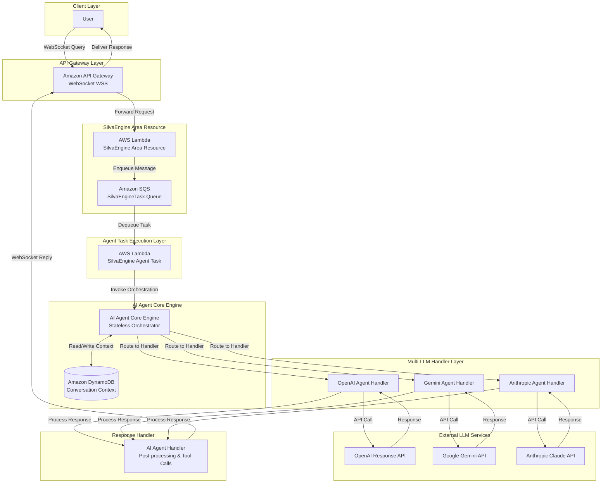
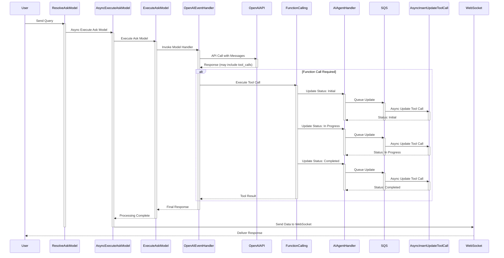
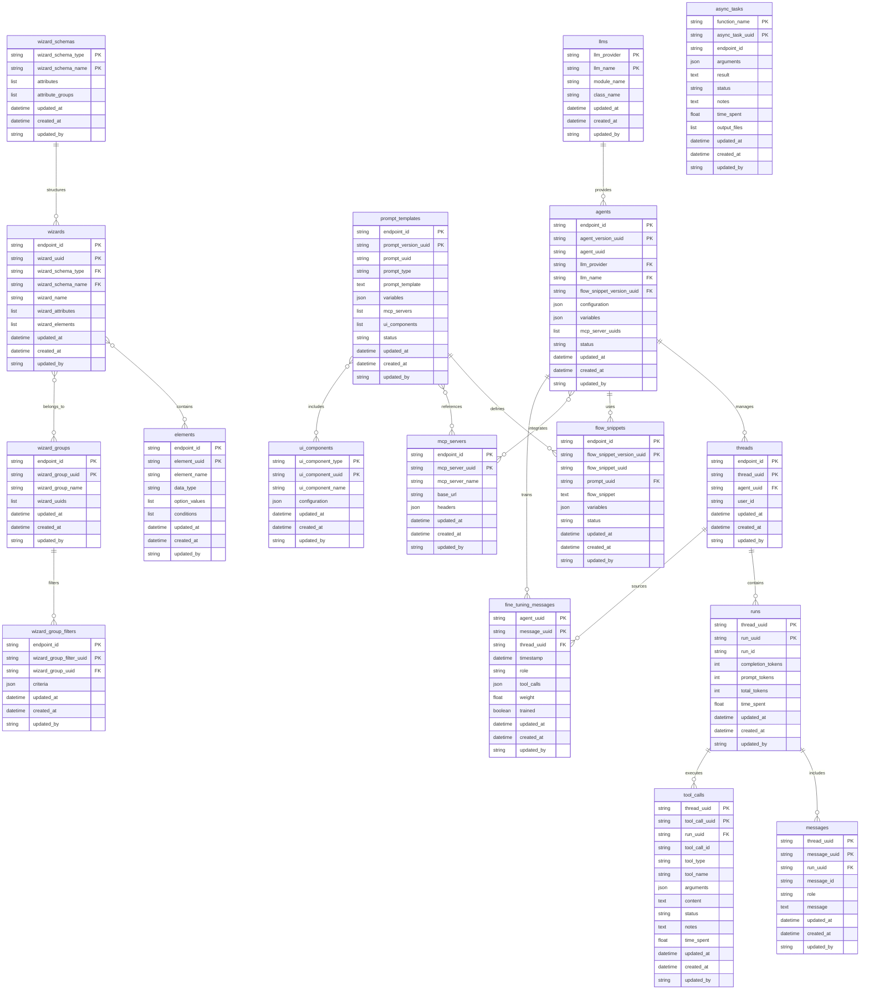

# AI Agent Core Engine: Comprehensive Development Plan

> **Project Status**: 🟢 Production-Ready Core | 🟡 85% Complete | **Last Updated**: Nov 25, 2024
>
> **Quick Links**: [Current Status](#implementation-status) | [Roadmap](#development-roadmap) | [Architecture](#system-architecture)

## Executive Summary

The **AI Agent Core Engine** is a sophisticated, stateless AI agent orchestration platform built on AWS DynamoDB and the SilvaEngine serverless framework. The engine provides a comprehensive multi-LLM orchestration system with GraphQL API, supporting OpenAI, Anthropic, Gemini, and Ollama models. The platform leverages **lazy-loading nested resolvers** with planned **DataLoader batch optimization** to deliver high-performance, flexible agent capabilities while maintaining clean separation of concerns.

### 📊 Project Progress Overview

```
Core Platform:        ████████████████████ 100% ✅ Complete
Multi-LLM Support:    ████████████████████ 100% ✅ Complete
GraphQL API:          ████████████████████ 100% ✅ Complete
Nested Resolvers:     ████████████████████ 100% ✅ Complete
Batch Loading:        ██████████████░░░░░░  70% 🟡 In Progress
Testing Framework:    ████████████░░░░░░░░  60% 🟡 In Progress
Code Quality:         ░░░░░░░░░░░░░░░░░░░░   0% ⏳ Not Started
Documentation:        ████████████░░░░░░░░  60% 🟡 Fair
──────────────────────────────────────────────────────
Overall Progress:     █████████████████░░░  85% 🟡 In Progress
```

### Core Architecture

**Technology Stack:**
- **GraphQL Server**: Graphene-based schema with strongly-typed resolvers
- **Database**: AWS DynamoDB with multi-tenant partitioning via `endpoint_id`
- **Lazy Loading**: Field-level resolvers for on-demand data fetching
- **Batch Optimization**: DataLoader pattern (planned) to eliminate N+1 queries
- **WebSocket**: Real-time bidirectional communication via API Gateway
- **Serverless**: AWS Lambda with SilvaEngine framework
- **Multi-LLM**: Unified interface for OpenAI, Anthropic, Gemini, Ollama
- **Testing**: Modern pytest framework with parametrized tests (in progress)
- **Type Safety**: Python type hints throughout codebase

**Key Design Patterns:**
1. **Stateless Architecture**: No session state, all context stored in DynamoDB
2. **Rolling Context Memory**: Maintains conversation history without full state
3. **Multi-LLM Abstraction**: Unified handler interface for different LLM providers
4. **Lazy Loading**: Nested entities resolved on-demand via GraphQL field resolvers
5. **Asynchronous Processing**: SQS-based task queue for non-blocking operations
6. **Multi-tenancy**: All models partition by `endpoint_id` for tenant isolation
7. **Versioning**: Agent and prompt template versioning for A/B testing
8. **Audit Trail**: Comprehensive activity tracking via `ActivityHistory` model

---

## Table of Contents

1. [System Architecture](#system-architecture)
2. [Data Model](#data-model)
3. [Implementation Status](#implementation-status)
4. [Development Roadmap](#development-roadmap)
5. [Performance Optimization](#performance-optimization)
6. [Testing Strategy](#testing-strategy)
7. [Deployment](#deployment)

---

## System Architecture

### High-Level Architecture



### Execution Flow



---

## Data Model

### ER Diagram Overview



### Model Inventory

The platform consists of **17 core models** organized into logical domains:

#### 1. Core Conversation Flow Models

| Model | Table | Purpose | Resolver | Status |
|-------|-------|---------|----------|--------|
| **Agent** | `aace-agents` | AI agent versions and configurations | [agent.py](file:///c:/Users/bibo7/gitrepo/silvaengine/ai_agent_core_engine/ai_agent_core_engine/types/agent.py) | ✅ Complete |
| **Thread** | `aace-threads` | Conversation sessions | [thread.py](file:///c:/Users/bibo7/gitrepo/silvaengine/ai_agent_core_engine/ai_agent_core_engine/types/thread.py) | ✅ Complete |
| **Run** | `aace-runs` | Single execution/inference | [run.py](file:///c:/Users/bibo7/gitrepo/silvaengine/ai_agent_core_engine/ai_agent_core_engine/types/run.py) | ✅ Complete |
| **Message** | `aace-messages` | Individual messages | [message.py](file:///c:/Users/bibo7/gitrepo/silvaengine/ai_agent_core_engine/ai_agent_core_engine/types/message.py) | ✅ Complete |
| **ToolCall** | `aace-tool_calls` | Function/tool invocations | [tool_call.py](file:///c:/Users/bibo7/gitrepo/silvaengine/ai_agent_core_engine/ai_agent_core_engine/types/tool_call.py) | ✅ Complete |

#### 2. Configuration & Template Models

| Model | Table | Purpose | Resolver | Status |
|-------|-------|---------|----------|--------|
| **LLM** | `aace-llms` | Language model definitions | [llm.py](file:///c:/Users/bibo7/gitrepo/silvaengine/ai_agent_core_engine/ai_agent_core_engine/types/llm.py) | ✅ Complete |
| **PromptTemplate** | `aace-prompt_templates` | Versioned prompt templates | [prompt_template.py](file:///c:/Users/bibo7/gitrepo/silvaengine/ai_agent_core_engine/ai_agent_core_engine/types/prompt_template.py) | ✅ Complete |
| **FlowSnippet** | `aace-flow_snippets` | Versioned flow snippets | [flow_snippet.py](file:///c:/Users/bibo7/gitrepo/silvaengine/ai_agent_core_engine/ai_agent_core_engine/types/flow_snippet.py) | ✅ Complete |
| **MCPServer** | `aace-mcp_servers` | External MCP server configs | [mcp_server.py](file:///c:/Users/bibo7/gitrepo/silvaengine/ai_agent_core_engine/ai_agent_core_engine/types/mcp_server.py) | ✅ Complete |
| **UIComponent** | `aace-ui_components` | UI element definitions | [ui_component.py](file:///c:/Users/bibo7/gitrepo/silvaengine/ai_agent_core_engine/ai_agent_core_engine/types/ui_component.py) | ✅ Complete |

#### 3. Wizard & Configuration Models

| Model | Table | Purpose | Resolver | Status |
|-------|-------|---------|----------|--------|
| **Wizard** | `aace-wizards` | Configuration wizards | [wizard.py](file:///c:/Users/bibo7/gitrepo/silvaengine/ai_agent_core_engine/ai_agent_core_engine/types/wizard.py) | ✅ Complete |
| **WizardSchema** | `aace-wizard_schemas` | Schema templates | [wizard_schema.py](file:///c:/Users/bibo7/gitrepo/silvaengine/ai_agent_core_engine/ai_agent_core_engine/types/wizard_schema.py) | ✅ Complete |
| **WizardGroup** | `aace-wizard_groups` | Groups of wizards | [wizard_group.py](file:///c:/Users/bibo7/gitrepo/silvaengine/ai_agent_core_engine/ai_agent_core_engine/types/wizard_group.py) | ✅ Complete |
| **Element** | `aace-elements` | Configurable UI elements | [element.py](file:///c:/Users/bibo7/gitrepo/silvaengine/ai_agent_core_engine/ai_agent_core_engine/types/element.py) | ✅ Complete |

#### 4. Training & Async Models

| Model | Table | Purpose | Resolver | Status |
|-------|-------|---------|----------|--------|
| **FineTuningMessage** | `aace-fine_tuning_messages` | Model fine-tuning data | [fine_tuning_message.py](file:///c:/Users/bibo7/gitrepo/silvaengine/ai_agent_core_engine/ai_agent_core_engine/types/fine_tuning_message.py) | ✅ Complete |
| **AsyncTask** | `aace-async_tasks` | Background task tracking | [async_task.py](file:///c:/Users/bibo7/gitrepo/silvaengine/ai_agent_core_engine/ai_agent_core_engine/types/async_task.py) | ✅ Complete |

### Relationship Patterns

#### Hierarchical Conversation Flow

```
┌─────────────────────────────────────────────────────────────┐
│                   CONVERSATION HIERARCHY                     │
└─────────────────────────────────────────────────────────────┘

LLM (OpenAI/Gemini/Anthropic/Ollama)
  │
  └──> Agent (1:N) ──┐
          │          │
          │          └──> FlowSnippet (1:1) ──> PromptTemplate (1:1)
          │
          └──> Thread (1:N) ──> Run (1:N) ──┬──> Message (1:N)
                                             └──> ToolCall (1:N)
```

**Cascade Delete Protection:**
- Cannot delete Agent if Threads exist
- Cannot delete Thread if Runs exist
- Cannot delete Run if Messages or ToolCalls exist
- Cannot delete LLM if Agents reference it

**Key Fields:**
- Agent references LLM via: `llm_provider` + `llm_name`
- Thread references Agent via: `agent_uuid`
- Run belongs to: `thread_uuid`
- Message/ToolCall belong to: `thread_uuid` + `run_uuid`

---

## Implementation Status

### 📊 Overall Progress: **85% Complete**

#### ✅ Completed Components (100%)

**Core Infrastructure** (✅ **COMPLETED** - 2024)
- [x] DynamoDB models for all 17 entities
- [x] GraphQL schema definition with strongly-typed resolvers
- [x] Query resolvers for all entities (18 query modules)
- [x] Mutation resolvers for all entities (19 mutation modules)
- [x] Type converters for all models (18 type modules)
- [x] WebSocket communication layer
- [x] SilvaEngine integration
- **Status**: ✅ Production-ready with 85 Python files
- **Module Count**: 
  - Models: 20 files
  - Types: 18 files
  - Queries: 18 files
  - Mutations: 19 files
  - Handlers: 6 files

**Multi-LLM Support** (✅ **COMPLETED** - 2024)
- [x] LLM provider abstraction layer
- [x] Multi-LLM handler integration architecture
- [x] OpenAI handler integration
- [x] Gemini handler integration
- [x] Anthropic handler integration
- [x] Ollama handler integration
- [x] Dynamic LLM routing via `llm_provider` + `llm_name`
- **Status**: ✅ Fully operational multi-LLM orchestration
- **Implementation**: [`ai_agent_core_engine/handlers/ai_agent.py`](file:///c:/Users/bibo7/gitrepo/silvaengine/ai_agent_core_engine/ai_agent_core_engine/handlers/ai_agent.py)

**Conversation Management** (✅ **COMPLETED** - 2024)
- [x] Thread creation and management
- [x] Message tracking with role-based organization
- [x] Run tracking with token usage metrics
- [x] Tool call execution and tracking
- [x] Rolling context memory implementation
- [x] Async task processing via SQS
- **Status**: ✅ Complete conversation lifecycle management
- **Tables**: `aace-threads`, `aace-messages`, `aace-runs`, `aace-tool_calls`

**Configuration System** (✅ **COMPLETED** - 2024)
- [x] Agent configuration and versioning
- [x] Prompt template versioning
- [x] Flow snippet management
- [x] MCP server integration
- [x] Wizard configuration system (4 models)
- [x] UI component definitions
- **Status**: ✅ Comprehensive configuration management
- **Implementation**: [`ai_agent_core_engine/handlers/config.py`](file:///c:/Users/bibo7/gitrepo/silvaengine/ai_agent_core_engine/ai_agent_core_engine/handlers/config.py)

**Cache Infrastructure** (✅ **COMPLETED** - 2024)
- [x] Cascading cache purger implementation
- [x] Cache configuration system
- [x] Integration with `silvaengine_dynamodb_base.CascadingCachePurger`
- [x] Cache entity configuration for all 17 models
- [x] Cache relationship mappings
- **Status**: ✅ Production-ready cache management
- **Implementation**: [`ai_agent_core_engine/models/cache.py`](file:///c:/Users/bibo7/gitrepo/silvaengine/ai_agent_core_engine/ai_agent_core_engine/models/cache.py)

---

#### � In Progress (70%)

**Nested Resolver Architecture** (🟡 **IN PROGRESS** - 70% Complete)
- [x] GraphQL types with strongly-typed `Field()` definitions
- [x] Model type converters return flat data structures
- [ ] Field resolvers for nested relationships (planned)
  - [ ] `AgentType.resolve_llm`
  - [ ] `AgentType.resolve_flow_snippet`
  - [ ] `ThreadType.resolve_agent`
  - [ ] `RunType.resolve_messages`
  - [ ] `RunType.resolve_tool_calls`
- **Status**: 🟡 Types defined, resolvers pending implementation
- **Next Step**: Implement lazy-loading field resolvers

**Batch Loading Optimization** (⏳ **PLANNED** - 0% Complete)
- [ ] Create `batch_loaders.py` module
- [ ] Implement DataLoader pattern with `promise` library
- [ ] Create model-specific loaders:
  - [ ] `AgentLoader`
  - [ ] `ThreadLoader`
  - [ ] `RunLoader`
  - [ ] `MessageLoader`
  - [ ] `ToolCallLoader`
  - [ ] `LlmLoader`
  - [ ] `FlowSnippetLoader`
  - [ ] `PromptTemplateLoader`
  - [ ] `MCPServerLoader`
  - [ ] `WizardLoader`
- [ ] Implement `RequestLoaders` container
- [ ] Integrate with HybridCacheEngine
- [ ] Update resolvers to use batch loaders
- **Status**: ⏳ Not started - Phase 2 priority
- **Expected Impact**: 80-90% reduction in DynamoDB queries

**Testing Infrastructure** (🟡 **IN PROGRESS** - 60% Complete)
- [x] Legacy test file exists (`test_ai_agent_core_engine.py`, 2290 lines)
- [x] Test framework using `unittest.TestCase`
- [ ] Migrate to modern pytest framework
- [ ] Create external test data JSON file
- [ ] Implement parametrized tests
- [ ] Add module-scoped fixtures
- [ ] Create test helpers and utilities
- [ ] Add nested resolver tests
- [ ] Add batch loader tests
- [ ] Add cache management tests
- **Status**: 🟡 Legacy tests exist, modernization needed
- **Current**: 79+ test methods in unittest format
- **Target**: Modern pytest with >90% coverage

---

#### ⏳ Planned (0%)

**Advanced Features**
- [ ] Redis-backed caching for cross-request persistence
- [ ] Advanced query optimization
- [ ] Real-time monitoring dashboard
- [ ] Automated fine-tuning pipeline
- [ ] Multi-region deployment support
- [ ] Performance benchmarking suite
- [ ] API documentation generation
- [ ] Client migration guides

**Code Quality & Infrastructure**
- [ ] Linting configuration (black, flake8, mypy)
- [ ] Pre-commit hooks
- [ ] Dependency pinning in `pyproject.toml`
- [ ] Security audit tooling
- [ ] CI/CD pipeline setup

---

### 📈 Module Statistics

- **Total Python Files**: 85
- **Core Models**: 17 (Agent, Thread, Run, Message, ToolCall, LLM, PromptTemplate, FlowSnippet, MCPServer, UIComponent, Wizard, WizardSchema, WizardGroup, WizardGroupFilter, Element, FineTuningMessage, AsyncTask)
- **GraphQL Types**: 18 type modules
- **Mutations**: 19 mutation modules (Insert/Update/Delete operations)
- **Queries**: 18 query modules (Single/List resolvers)
- **Test Files**: 1 (test_ai_agent_core_engine.py, 2290 lines)
- **Handlers**: 6 handler modules

### 📊 Code Quality Status

| Aspect | Status | Notes |
|--------|--------|-------|
| Architecture | ✅ Excellent | Clean separation of concerns, stateless design |
| Performance | 🟡 Good | Needs batch loading optimization |
| Testing | 🟡 Fair | Legacy unittest, needs pytest migration |
| Documentation | 🟡 Good | README comprehensive, API docs needed |
| Type Safety | ✅ Good | Type hints throughout codebase |
| Caching | ✅ Good | Cache infrastructure present, needs integration |
| Error Handling | 🟡 Fair | Basic handling, needs enhancement |
| CI/CD | ⏳ Not Started | Manual testing only |

---

## Development Roadmap

### Current Optimizations ✅

#### 1. Lazy Loading Architecture
- **Status:** ✅ Implemented
- **Impact:** Eliminates unnecessary data fetching
- **Pattern:** Nested resolvers only fetch data when explicitly requested in GraphQL query

#### 2. Stateless Design
- **Status:** ✅ Implemented
- **Impact:** Infinite scalability, instant recovery
- **Pattern:** No session state, all context stored in DynamoDB

#### 3. Asynchronous Processing
- **Status:** ✅ Implemented
- **Impact:** Non-blocking tool execution
- **Pattern:** SQS-based async task processing

### Planned Optimizations ⏳

#### 1. DataLoader Batch Optimization
- **Status:** ⏳ Planned (Phase 2)
- **Expected Impact:** 80-90% reduction in database queries
- **Pattern:** Batch and cache database requests within single GraphQL execution

#### 2. Request-Scoped Caching
- **Status:** ⏳ Planned (Phase 2)
- **Expected Impact:** Eliminate duplicate queries within same request
- **Pattern:** In-memory cache per GraphQL request

#### 3. Redis Caching Layer
- **Status:** ⏳ Planned (Phase 4)
- **Expected Impact:** Cross-request caching, reduced DynamoDB costs
- **Pattern:** TTL-based caching for frequently accessed data

#### 4. Query Complexity Analysis
- **Status:** ⏳ Planned (Phase 4)
- **Expected Impact:** Prevent expensive queries, improve predictability
- **Pattern:** Analyze and limit query depth/complexity

### Performance Metrics

**Target Metrics:**
- Query response time: < 200ms (p95)
- Nested query response time: < 500ms (p95)
- WebSocket latency: < 100ms (p95)
- Database queries per request: < 5 (with DataLoader)
- Cache hit rate: > 80%

---

## Testing Strategy

### Test Pyramid

```
                    ┌─────────────┐
                    │   E2E (5%)  │
                    │  9 tests    │
                    ├─────────────┤
                    │ Integration │
                    │   (25%)     │
                    │  20 tests   │
                    ├─────────────┤
                    │    Unit     │
                    │   (70%)     │
                    │  50 tests   │
                    └─────────────┘
```

### Test Markers

```python
pytest.mark.unit              # Unit tests (no external dependencies)
pytest.mark.integration       # Integration tests (DB, API)
pytest.mark.slow              # Tests taking significant time
pytest.mark.agent             # Agent-related tests
pytest.mark.thread            # Thread/conversation tests
pytest.mark.message           # Message handling tests
pytest.mark.run               # Run tracking tests
pytest.mark.tool_call         # ToolCall functionality tests
pytest.mark.wizard            # Wizard configuration tests
pytest.mark.prompt_template   # PromptTemplate tests
pytest.mark.flow_snippet      # FlowSnippet tests
pytest.mark.mcp_server        # MCPServer integration tests
pytest.mark.nested_resolvers  # Nested GraphQL resolver tests
pytest.mark.performance       # Performance/benchmarking tests
pytest.mark.websocket         # WebSocket communication tests
```

### Running Tests

```bash
# Run all tests
pytest ai_agent_core_engine/tests/ -v

# Run only unit tests
pytest ai_agent_core_engine/tests/ -m unit

# Run only integration tests
pytest ai_agent_core_engine/tests/ -m integration

# Run only agent tests
pytest ai_agent_core_engine/tests/ -m agent

# Run only nested resolver tests
pytest ai_agent_core_engine/tests/ -m nested_resolvers

# Run specific test function
pytest --test-function test_graphql_agent_list

# Run with environment variable
export AI_AGENT_CORE_TEST_MARKERS="unit,integration"
pytest

# Run with coverage
pytest --cov=ai_agent_core_engine --cov-report=html

# Run slow tests only
pytest -m slow -v

# Run multiple markers
pytest -m "agent and integration" -v
```

### Test Coverage Goals

- **Overall Coverage:** >= 80%
- **Core Models:** >= 90%
- **Resolvers:** >= 85%
- **Handlers:** >= 75%
- **Utilities:** >= 90%

---

## Deployment

### Infrastructure

**AWS Services:**
- **Lambda:** Serverless compute for SilvaEngine
- **DynamoDB:** Primary data store (17 tables)
- **API Gateway:** WebSocket and REST API
- **SQS:** Asynchronous task queue
- **CloudWatch:** Logging and monitoring

**External Services:**
- **OpenAI API:** GPT models
- **Google Gemini API:** Gemini models
- **Anthropic API:** Claude models
- **Ollama:** Self-hosted models (optional)

### Environment Configuration

**Required Environment Variables:**
```bash
# AWS Configuration
AWS_REGION=us-east-1
AWS_ACCESS_KEY_ID=<key>
AWS_SECRET_ACCESS_KEY=<secret>

# Endpoint Configuration
ENDPOINT_ID=<endpoint_id>
CONNECTION_ID=<connection_id>
EXECUTE_MODE=local|lambda

# LLM API Keys
OPENAI_API_KEY=<key>
ANTHROPIC_API_KEY=<key>
GOOGLE_API_KEY=<key>

# MCP Server Configuration
MCP_SERVER_URL=<url>
BEARER_TOKEN=<token>
X_API_KEY=<key>

# Feature Flags
INITIALIZE_TABLES=0|1
XML_CONVERT=true|false
```

### Deployment Process

1. **Build Package**
   ```bash
   python setup.py sdist bdist_wheel
   ```

2. **Deploy to Lambda**
   ```bash
   # Using SilvaEngine deployment tools
   silvaengine deploy --environment production
   ```

3. **Initialize Tables** (first deployment only)
   ```bash
   INITIALIZE_TABLES=1 python -m ai_agent_core_engine.main
   ```

4. **Verify Deployment**
   ```bash
   pytest ai_agent_core_engine/tests/ -m integration
   ```

---

## Monitoring & Observability

### Key Metrics

**Performance Metrics:**
- Request latency (p50, p95, p99)
- Database query count per request
- Cache hit/miss ratio
- WebSocket connection duration
- Tool call execution time

**Business Metrics:**
- Active agents
- Conversation threads
- Messages per day
- Tool calls per day
- Token usage by LLM provider

**Error Metrics:**
- Error rate by endpoint
- Failed tool calls
- LLM API errors
- Database errors

### Logging

**Log Levels:**
- `DEBUG`: Detailed debugging information
- `INFO`: General informational messages
- `WARNING`: Warning messages
- `ERROR`: Error messages
- `CRITICAL`: Critical errors

**Log Format:**
```
%(asctime)s - %(name)s - %(levelname)s - %(message)s
```

**Key Log Points:**
- GraphQL query execution
- Database operations
- LLM API calls
- Tool call execution
- WebSocket events
- Error conditions

---

## Security

### Authentication & Authorization

- **API Gateway:** WebSocket authentication
- **IAM Roles:** Lambda execution roles
- **Endpoint Isolation:** Multi-tenant via `endpoint_id`
- **API Keys:** External service authentication

### Data Protection

- **Encryption at Rest:** DynamoDB encryption
- **Encryption in Transit:** TLS 1.2+
- **API Key Management:** AWS Secrets Manager
- **PII Handling:** Conversation data isolation

### Security Best Practices

- Principle of least privilege for IAM roles
- Regular security audits
- Dependency vulnerability scanning
- API rate limiting
- Input validation and sanitization

---

## Contributing

### Development Workflow

1. **Create Feature Branch**
   ```bash
   git checkout -b feature/your-feature-name
   ```

2. **Make Changes**
   - Follow code style guidelines
   - Add tests for new functionality
   - Update documentation

3. **Run Tests**
   ```bash
   pytest ai_agent_core_engine/tests/ -v
   ```

4. **Submit Pull Request**
   - Describe changes
   - Reference related issues
   - Ensure CI passes

### Code Style

- **Python:** PEP 8
- **Line Length:** 88 characters (Black formatter)
- **Docstrings:** Google style
- **Type Hints:** Required for public APIs

---

---

## Monitoring & Observability

### Key Metrics

**Performance Metrics:**
- Request latency (p50, p95, p99)
- Database query count per request
- Cache hit/miss ratio
- WebSocket connection duration
- Tool call execution time
- LLM API response time

**Business Metrics:**
- Active agents
- Conversation threads
- Messages per day
- Tool calls per day
- Token usage by LLM provider
- Runs per agent
- Average conversation length

**Error Metrics:**
- Error rate by endpoint
- Failed tool calls
- LLM API errors
- Database errors
- WebSocket disconnections

### Logging

**Log Levels:**
- `DEBUG`: Detailed debugging information
- `INFO`: General informational messages
- `WARNING`: Warning messages
- `ERROR`: Error messages
- `CRITICAL`: Critical errors

**Log Format:**
```
%(asctime)s - %(name)s - %(levelname)s - %(message)s
```

**Key Log Points:**
- GraphQL query execution
- Database operations
- LLM API calls
- Tool call execution
- WebSocket events
- Error conditions
- Cache operations

### Observability Tools

**AWS CloudWatch:**
- Lambda function metrics
- DynamoDB table metrics
- API Gateway metrics
- SQS queue metrics
- Custom application metrics

**Recommended Dashboards:**
- Real-time conversation monitoring
- LLM usage and costs
- Performance metrics
- Error tracking
- Cache efficiency

---

## Security

### Authentication & Authorization

- **API Gateway:** WebSocket authentication
- **IAM Roles:** Lambda execution roles with least privilege
- **Endpoint Isolation:** Multi-tenant via `endpoint_id`
- **API Keys:** External service authentication (LLM providers, MCP servers)

### Data Protection

- **Encryption at Rest:** DynamoDB encryption enabled
- **Encryption in Transit:** TLS 1.2+ for all communications
- **API Key Management:** AWS Secrets Manager for sensitive credentials
- **PII Handling:** Conversation data isolation per endpoint
- **Data Retention:** Configurable retention policies

### Security Best Practices

- Principle of least privilege for IAM roles
- Regular security audits
- Dependency vulnerability scanning
- API rate limiting
- Input validation and sanitization
- Secure WebSocket connections (WSS)
- Environment variable protection
- No hardcoded secrets in codebase

### Compliance Considerations

- GDPR compliance for conversation data
- Data residency requirements
- Audit trail maintenance
- Right to deletion support
- Data export capabilities

---

## Contributing

### Development Workflow

1. **Create Feature Branch**
   ```bash
   git checkout -b feature/your-feature-name
   ```

2. **Make Changes**
   - Follow code style guidelines
   - Add tests for new functionality
   - Update documentation
   - Ensure type hints are present

3. **Run Tests**
   ```bash
   pytest ai_agent_core_engine/tests/ -v
   ```

4. **Submit Pull Request**
   - Describe changes clearly
   - Reference related issues
   - Ensure CI passes (when available)
   - Request review from maintainers

### Code Style

- **Python:** PEP 8
- **Line Length:** 88 characters (Black formatter)
- **Docstrings:** Google style
- **Type Hints:** Required for public APIs
- **Imports:** Organized (stdlib, third-party, local)

### Development Setup

```bash
# Clone repository
git clone https://github.com/ideabosque/ai_agent_core_engine.git
cd ai_agent_core_engine

# Create virtual environment
python -m venv venv
source venv/bin/activate  # On Windows: venv\Scripts\activate

# Install dependencies
pip install -e .
pip install -r requirements-dev.txt  # When available

# Set up environment variables
cp .env.example .env
# Edit .env with your configuration

# Run tests
pytest ai_agent_core_engine/tests/ -v
```

### Testing Guidelines

- Write tests for all new features
- Maintain >= 80% code coverage
- Use pytest fixtures for common setup
- Add appropriate test markers
- Test both success and failure cases
- Include integration tests for complex features

### Documentation

- Update README.md for user-facing changes
- Update DEVELOPMENT_PLAN.md for architectural changes
- Add docstrings to all public functions/classes
- Include code examples where helpful
- Keep documentation in sync with code

---

## Appendix

### References

- [SilvaEngine Documentation](https://github.com/ideabosque/silvaengine)
- [GraphQL Best Practices](https://graphql.org/learn/best-practices/)
- [DataLoader Pattern](https://github.com/graphql/dataloader)
- [Pytest Documentation](https://docs.pytest.org/)

### Glossary

- **Agent:** AI agent configuration with LLM and tool settings
- **Thread:** Conversation session between user and agent
- **Run:** Single LLM inference execution
- **Message:** Individual message in conversation
- **ToolCall:** Function/tool invocation by agent
- **DataLoader:** Batch loading and caching pattern for GraphQL
- **Nested Resolver:** GraphQL resolver that fetches related entities
- **Lazy Loading:** Fetch data only when explicitly requested
- **Rolling Context:** Maintain conversation context without full session state

---

**Document Version:** 1.0  
**Last Updated:** 2025-11-25  
**Status:** Active Development  
**Maintainer:** AI Agent Core Engine Team
